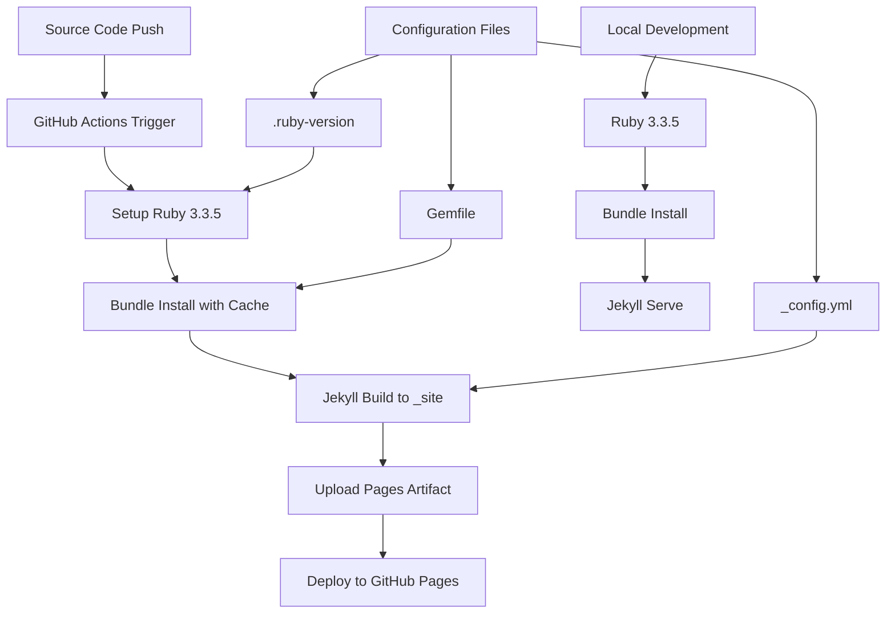

# Design Document: GitHub Pages Compatibility Refactoring

## Overview

This design addresses the refactoring of a Jekyll 4.4.0 Vietnamese blog project to ensure seamless GitHub Pages deployment. The current project uses modern Jekyll features but has configuration mismatches that prevent proper GitHub Pages deployment. The solution involves updating the GitHub Actions workflow, adjusting build configurations, and ensuring compatibility with GitHub Pages constraints while preserving all existing functionality.

**Key Challenge**: GitHub Pages officially supports Jekyll 3.10.0, but we want to maintain Jekyll 4.4.0 with modern features. The solution is to use GitHub Actions for custom builds rather than relying on GitHub Pages' built-in Jekyll processing.

## Architecture

### Current State
- Jekyll 4.4.0 with modern plugins (jekyll-paginate-v2, etc.)
- Ruby 3.3.5 specified in .ruby-version
- Build output to `./build` directory
- GitHub Actions workflow using Ruby 3.1
- Custom devlopr theme with Vietnamese content

### Target State
- Jekyll 4.4.0 maintained with GitHub Actions custom build
- Ruby version alignment between local and CI environments
- Standard `_site` output directory for GitHub Pages compatibility
- Optimized GitHub Actions workflow with proper caching
- Full compatibility with GitHub Pages hosting constraints

### Build Pipeline Architecture



## Components and Interfaces

### 1. GitHub Actions Workflow Component
**Purpose**: Orchestrates the build and deployment process
**Location**: `.github/workflows/jekyll.yml`

**Key Responsibilities**:
- Use Ruby version from `.ruby-version` file
- Install dependencies with bundler caching
- Build Jekyll site with production settings
- Upload artifacts to GitHub Pages
- Handle deployment with proper permissions

**Interface**:
```yaml
# Input: Source code changes
# Output: Deployed GitHub Pages site
# Dependencies: Ruby, Bundler, Jekyll, GitHub Pages API
```

### 2. Jekyll Configuration Component
**Purpose**: Manages Jekyll build settings and environment-specific configurations
**Location**: `_config.yml`

**Key Responsibilities**:
- Configure build destination for different environments
- Manage plugin configurations
- Handle baseurl for GitHub Pages
- Set up asset processing

**Interface**:
```yaml
# Environment Variables:
# - JEKYLL_ENV: production|development
# - GITHUB_PAGES_BASEURL: for dynamic baseurl setting
```

### 3. Asset Processing Component
**Purpose**: Handles SASS compilation, image optimization, and asset URL generation
**Dependencies**: jekyll-sass-converter, asset pipeline

**Key Responsibilities**:
- Compile SASS with proper source maps for development
- Generate correct asset URLs for GitHub Pages
- Handle font loading and CDN compatibility
- Process images and optimize for web delivery

### 4. Content Management Component
**Purpose**: Manages Vietnamese blog posts, pagination, and category organization
**Dependencies**: jekyll-paginate-v2, jekyll-feed, jekyll-seo-tag

**Key Responsibilities**:
- Preserve Vietnamese character encoding
- Generate paginated post listings
- Maintain category and tag organization
- Create RSS feeds with correct URLs

### 5. Plugin Compatibility Layer
**Purpose**: Ensures all Jekyll plugins work within GitHub Pages constraints
**Location**: Gemfile, _config.yml plugins section

**Key Responsibilities**:
- Validate plugin compatibility with GitHub Actions build
- Provide fallbacks for unsupported features
- Document any limitations or workarounds

## Data Models

### Build Configuration Model
```yaml
BuildConfig:
  ruby_version: string          # From .ruby-version
  jekyll_version: string        # From Gemfile
  destination: string           # Build output directory
  baseurl: string              # GitHub Pages baseurl
  environment: enum            # development|production
  plugins: array[string]       # Enabled Jekyll plugins
```

### Site Metadata Model
```yaml
SiteMetadata:
  title: string
  description: string
  url: string                  # Full site URL
  baseurl: string             # Subpath for GitHub Pages
  author: AuthorInfo
  social_links: SocialLinks
  seo_settings: SEOConfig
```

### Content Model
```yaml
BlogPost:
  title: string
  date: datetime
  categories: array[string]
  tags: array[string]
  content: string             # Vietnamese content with proper encoding
  permalink: string           # URL structure
  seo_meta: SEOMetadata
```

### Pagination Model
```yaml
PaginationConfig:
  enabled: boolean
  per_page: integer
  permalink: string           # URL pattern for paginated pages
  sort_field: string
  sort_reverse: boolean
  trail: TrailConfig
```
## Correctness Properties

*A property is a characteristic or behavior that should hold true across all valid executions of a system—essentially, a formal statement about what the system should do. Properties serve as the bridge between human-readable specifications and machine-verifiable correctness guarantees.*

### Property 1: Ruby Version Consistency
*For any* build environment (local or CI), the Ruby version used should match the version specified in the .ruby-version file
**Validates: Requirements 1.3**

### Property 2: Build Output Directory Consistency  
*For any* Jekyll build configuration, when the site is built, all generated files should be placed in the _site directory for GitHub Pages compatibility
**Validates: Requirements 2.1**

### Property 3: Plugin Compatibility Validation
*For any* plugin listed in the Gemfile, the build system should either confirm GitHub Pages compatibility or provide documented alternatives
**Validates: Requirements 3.2**

### Property 4: Asset URL Generation with Baseurl
*For any* asset (CSS, JS, images, fonts) processed by the asset pipeline, the generated URLs should correctly include the configured baseurl for GitHub Pages compatibility
**Validates: Requirements 3.3, 5.2**

### Property 5: Content Preservation During Refactoring
*For any* existing content (blog posts, categories, social links), the refactoring process should preserve all content with correct encoding and organization
**Validates: Requirements 4.1, 4.4, 4.5**

### Property 6: Pagination Functionality Preservation
*For any* paginated content, the jekyll-paginate-v2 system should continue to generate correct paginated pages with proper navigation
**Validates: Requirements 4.2**

### Property 7: Asset Pipeline Processing
*For any* asset type (SASS, JavaScript, fonts), the asset pipeline should process and generate files compatible with GitHub Pages environment constraints
**Validates: Requirements 5.1, 5.3, 5.4**

### Property 8: Build Caching Optimization
*For any* build process (local or CI), when dependencies haven't changed, the system should utilize caching to optimize build performance
**Validates: Requirements 1.2, 6.2**

### Property 9: Configuration Environment Handling
*For any* environment (development or production), the build system should apply appropriate configuration settings while maintaining GitHub Pages compatibility
**Validates: Requirements 7.1, 7.2**

### Property 10: SEO and Social Metadata Preservation
*For any* page generated, the system should preserve all SEO tags, Open Graph metadata, and Twitter Card information in the output HTML
**Validates: Requirements 8.1, 8.4**

### Property 11: Feed Generation with Correct URLs
*For any* generated feed (sitemap, RSS), the URLs should be correctly formatted with the appropriate baseurl for GitHub Pages deployment
**Validates: Requirements 8.2, 8.3**

## Error Handling

### Build Failure Scenarios
1. **Ruby Version Mismatch**: Clear error messages when local and CI Ruby versions differ
2. **Plugin Incompatibility**: Warnings when unsupported plugins are detected
3. **Asset Path Errors**: Descriptive errors for missing or incorrect asset references
4. **Configuration Conflicts**: Guidance messages for conflicting settings

### Fallback Mechanisms
1. **Plugin Alternatives**: Documented alternatives for GitHub Pages incompatible plugins
2. **Asset Fallbacks**: CDN fallbacks for assets that fail to load
3. **SEO Alternatives**: Alternative implementations when SEO features conflict with GitHub Pages constraints

### Error Recovery
1. **Graceful Degradation**: Site continues to function even if non-critical features fail
2. **Build Continuation**: Build process continues after non-fatal errors with warnings
3. **Cache Invalidation**: Automatic cache clearing when build errors are detected

## Testing Strategy

### Dual Testing Approach
This project requires both unit testing and property-based testing to ensure comprehensive coverage:

- **Unit tests**: Verify specific examples, edge cases, and error conditions
- **Property tests**: Verify universal properties across all inputs
- Both approaches are complementary and necessary for complete validation

### Unit Testing Focus Areas
- Specific configuration examples (Ruby 3.3.5 usage, _site output directory)
- Integration points between Jekyll and GitHub Actions
- Edge cases (empty content, special characters in Vietnamese posts)
- Error conditions (missing files, invalid configurations)

### Property-Based Testing Configuration
- **Testing Library**: Use `rspec-quickcheck` for Ruby-based property testing
- **Minimum Iterations**: 100 iterations per property test to ensure comprehensive coverage
- **Test Tagging**: Each property test must reference its design document property
- **Tag Format**: `# Feature: github-pages-compatibility, Property {number}: {property_text}`

### Property Test Implementation Requirements
- Each correctness property must be implemented by a single property-based test
- Tests should generate random valid configurations and verify properties hold
- Focus on universal behaviors that should work across all valid inputs
- Complement unit tests by covering broad input spaces rather than specific examples

### Integration Testing
- End-to-end deployment testing with actual GitHub Pages
- Cross-environment compatibility testing (local vs CI)
- Performance testing for build times and caching effectiveness
- Vietnamese content encoding validation across different environments